# ConfigMaps

- Decouple configuration from pods and components
- stores configuration data as key-value pairs
- dont contain sensitive information
- must create a configMap before referencing it in a pod spec

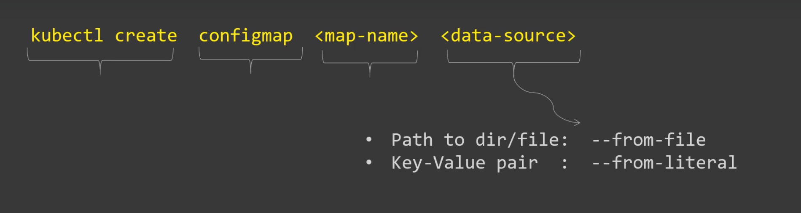

## 三种方式构建configmap

### 从directories

下载两个示例文件

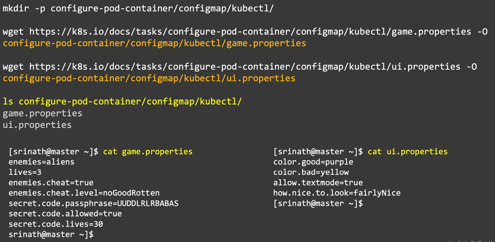

创建configmap

```bash
kubect create configmap game-config --from-file=configure-podcontainer/configmap/kubectl/

kubectl get configmaps -o wide
```

检查configmap

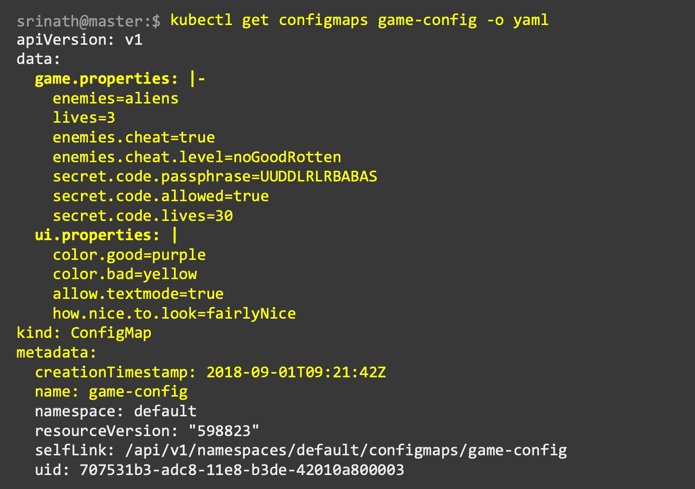

### 从单一文件中

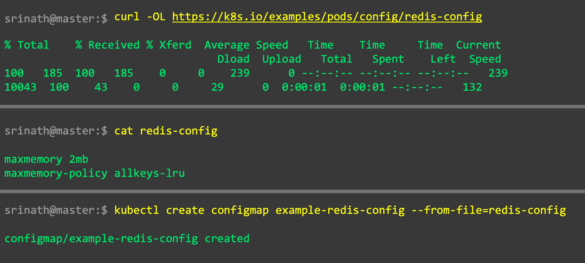

Access configMaps in pods 两种方式

1. 使用volumes

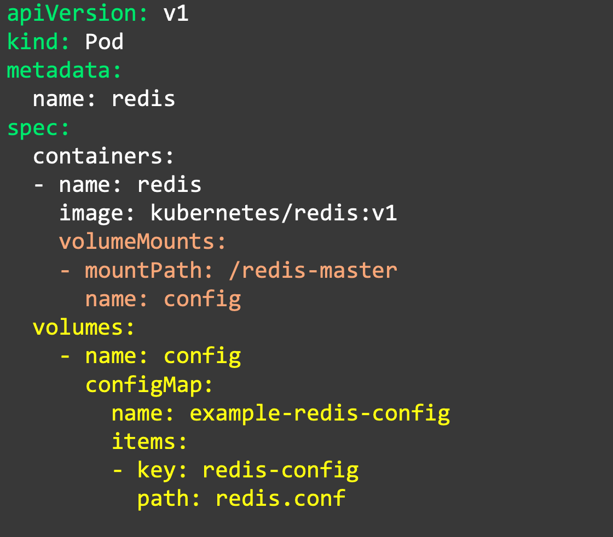

检查是否pod可以access configmap

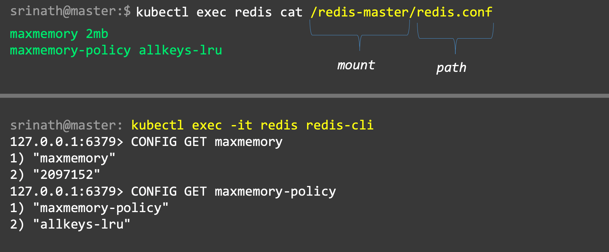

2. 使用environment variable

### 从literals values

从command line直接传入configmap

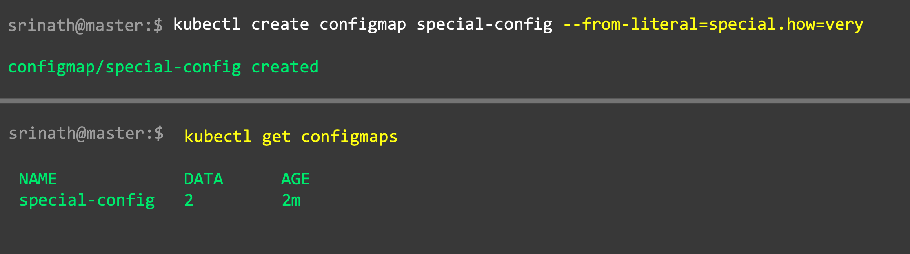

从environment variables中access configmaps


## Demo

### 从文件中创建configmap

nginx-pod-configmap-vol.yaml

```yaml
apiVersion: v1
kind: Pod
metadata:
  name: nginx-pod-configmap-vol
spec:
  containers:
    - name: nginx-container
      image: nginx
      volumeMounts:
        - name: test-vol
          mountPath: "/etc/non-sensitive-data"
          readOnly: true
  volumes:
    - name: test-vol
      configMap:
        name: nginx-configmap-vol
        items:
          - key: file-1.txt
            path: file-a.txt
          - key: file-2.txt
            path: file-b.txt
```

```bash
# create configmap from files
kubectl get configmaps

cd configmaps

# create two files
echo -n 'Non-sensitive data inside file-1' > file-1.txt
echo -n 'Non-sensitive data inside file-2' > file-2.txt

# create configmap named nginx-configmap-vol from two files
kubectl create configmap nginx-configmap-vol --from-file=file-1.txt --from-file=file-2.txt

# print configmap in yaml format
kubectl get configmaps nginx-configmap-vol -o yaml
# print configmap by describe
kubectl describe configmap nginx-configmap-vol

# how to use this configmap in pod?
# 在上边的yaml中的volumes
# 测试
# 创建pod
kubectl create -f nginx-pod-configmap-vol.yaml
kubectl get pods -o wide

get configmaps
# 进入pod
kubectl exec nginx-pod-configmap-vol -it /bin/sh
# 进入mount的path
cd /etc/non-sensitive-data
# 查看文件
ls 
# 显示文件
cat file-a.txt

# Validate from "outside" the pod
kubectl exec nginx-pod-configmap-vol ls /etc/non-sensitive-data
kubectl exec nginx-pod-configmap-vol cat /etc/non-sensitive-data/file-a.txt
kubectl exec nginx-pod-configmap-vol cat /etc/non-sensitive-data/file-b.txt
```

### 从literal values中创建configmap

redis-pod-configmap-env.yaml

使用env而不是volume

```yaml
apiVersion: v1
kind: Pod
metadata:
  name: redis-pod-configmap-env
spec:
  containers:
    - name: redis-container
      image: redis
      env:
        - name: FILE_1
          valueFrom:
            configMapKeyRef:
              name: redis-configmap-env
              key: file.1
        - name: FILE_2
          valueFrom:
            configMapKeyRef:
              name: redis-configmap-env
              key: file.2
  restartPolicy: Never
```

```bash
# 创建configmap redis-configmap-env
# key是file.1 和 file.2
# value是file.a 和 file.b
kubectl create configmap redis-configmap-env --from-literal=file.1=file.a --from-literal=file.2=file.b

kubectl get configmap
kubectl describe configmap redis-configmap-env

# 创建pod
kubectl create -f  redis-pod-configmap-env.yaml

kubectl get pods
kubectl get configmaps
kubectl describe pod redis-pod-configmap-env

# Validate from "inside" the pod
# 进入pod
kubectl exec redis-pod-configmap-env -it /bin/sh
# 查看pod中的env
env | grep  FILE
# FILE_1=file.a
# FILE_2=file.b

# Validate from "outside" the pod
kubectl exec redis-pod-configmap-env env | grep FILE
```

### 清除

```bash
kubectl get pods
kubectl get configmaps

# Delete configmaps
kubectl delete configmaps nginx-configmap-vol redis-configmap-env

# Delete pods
kubectl delete pods nginx-pod-configmap-vol redis-pod-configmap-env

# Validate
kubectl get pods
kubectl get configmaps
```

# Secrets

secrets: Kubernetes object to handle small amount of sensitive data

- Small amount of sensitive data
    - Passwords, Tokens, or Keys
- Reduces risk of exposing sensitive data
- Created outside of Pods
- Not more than 1 MB
- Stored inside ETCD database on Kubernetes Master
- Used in two ways- Volumes or Env variables
- Sent only to the target nodes

## 两种方式创建secrets: kubectl, manually

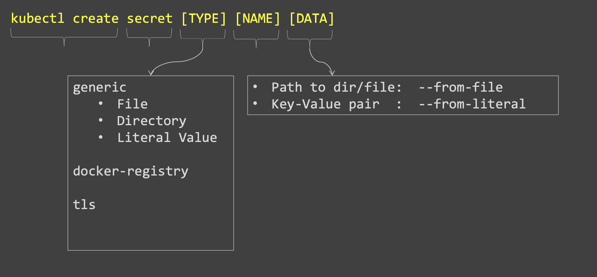

### 使用kubectl

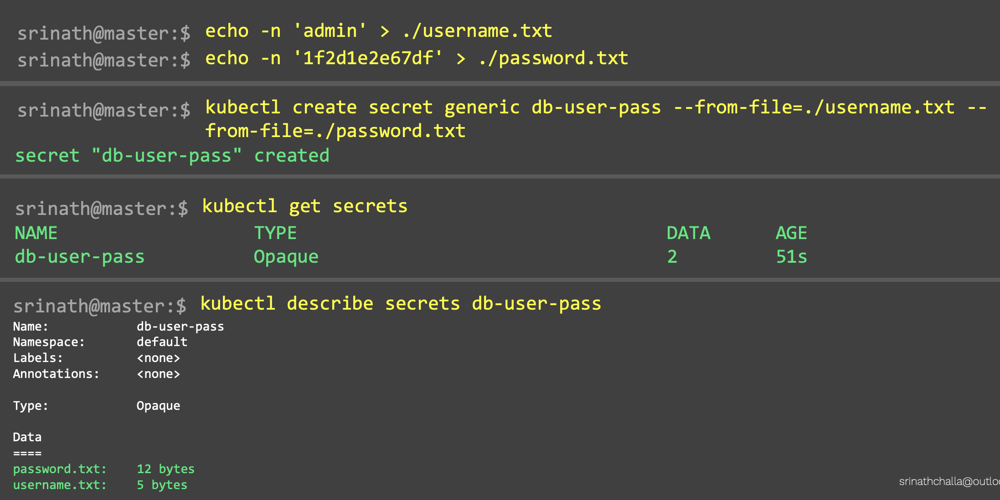

### manually

需要encode

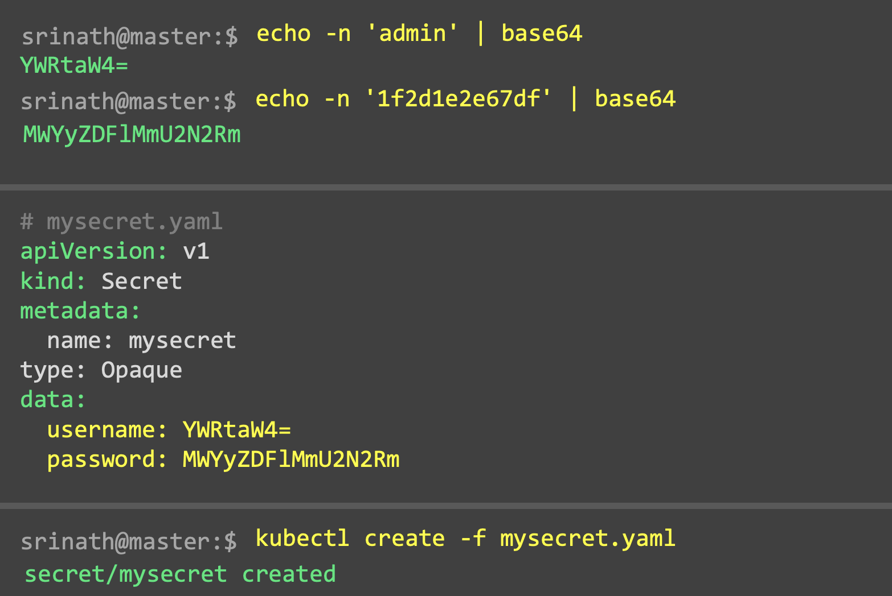

decode

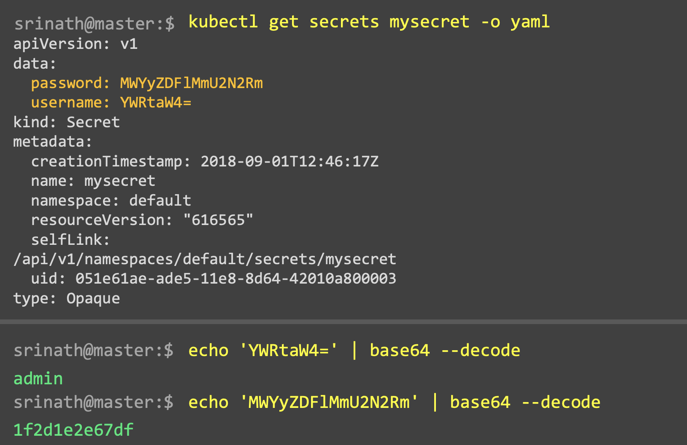

## 如何在pod中使用

两种方式: volume, environment variables

创建

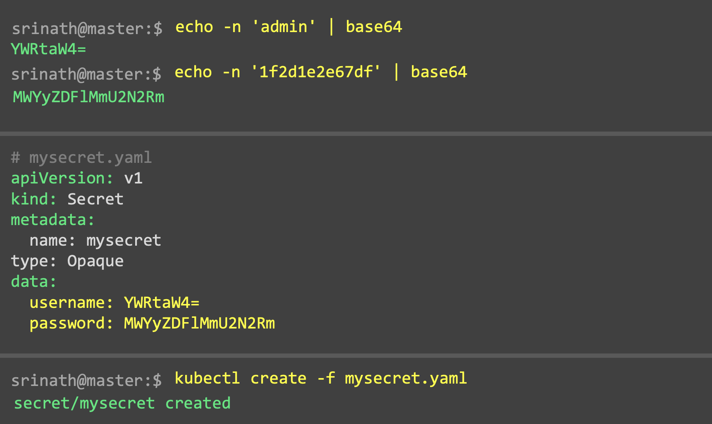

使用volume

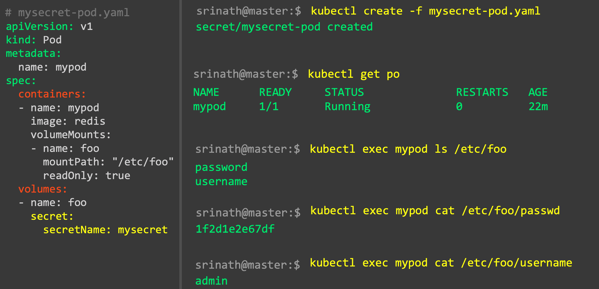

使用environment variables

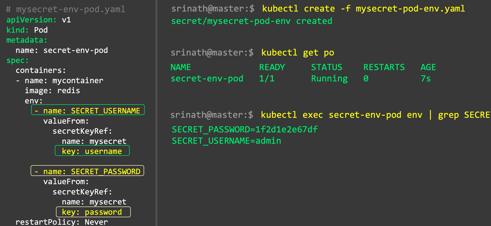

## Demo

1. Create Secret using "kubectl" & Consuming it from "volumes" inside Pod

1a. Create secret "nginx-secret-vol" using "Kubectl"
1b. Consume "nginx-secret-vol" from "volumes" inside Pod 1c. Create | Display | Validate

nginx-pod-secret-vol.yaml

mountPath就是把secret放到pod的文件路径，之后可以在pod中用这个路径拿到secret文件

```yaml
apiVersion: v1
kind: Pod
metadata:
  name: nginx-pod-secret-vol
spec:
  containers:
    - name: nginx-container
      image: nginx
      volumeMounts:
        - name: test-vol
          mountPath: "/etc/confidential"
          readOnly: true
  volumes:
    - name: test-vol
      secret:
        secretName: nginx-secret-vol
```

```bash
kubectl get nodes
# 创建两个file
cd secrets

echo -n 'admin' > username.txt
echo -n 'pa$$w00rd' > password.txt
# 创建一个secret nginx-secret-vol
kubectl create secret generic nginx-secret-vol --from-file=username.txt --from-file=password.txt
# 查看secret
kubectl get secrets
kubectl describe secrets nginx-secret-vol

# 创建pod
kubectl create -f nginx-pod-secret-vol.yaml

# 查看
kubectl get po
kubectl get secrets
kubectl describe pod nginx-pod-secret-vol

# Validate from "inside" the pod
# 进入pod
kubectl exec nginx-pod-secret-vol -it /bin/sh
cd /etc/confidential # mountPath
ls 
cat username.txt
cat password.txt

# Validate from "outside" the pod
kubectl exec nginx-pod-secret-vol ls /etc/confidential
kubectl exec nginx-pod-secret-vol cat /etc/confidential/username.txt
kubectl exec nginx-pod-secret-vol cat /etc/confidential/password.txt
```

2. Create Secret "manually" using YAML file & Consuming it from "environment variables" inside Pod

2a. Create secret redis-secret-env using YAML file:
2b. Consume redis-secret-env secret from ìEnvironment Variables inside pod 2c. Create | Display | Validate

redis-pod-secret-env.yaml

```yaml
apiVersion: v1
kind: Pod
metadata:
  name: redis-pod-secret-env
spec:
  containers:
    - name: redis-container
      image: redis
      env:
        - name: SECRET_USERNAME # 在pod中的env name
          valueFrom:
            secretKeyRef:
              name: redis-secret-env # secret name
              key: username # secret key
        - name: SECRET_PASSWORD
          valueFrom:
            secretKeyRef:
              name: redis-secret-env
              key: password
  restartPolicy: Never
```

redis-secret-env.yaml

创建secret用yaml文件

```yaml
apiVersion: v1
kind: Secret
metadata:
  name: redis-secret-env
type: Opaque
data:
  username: YWRtaW4=
  password: cGEkJHcwMHJk
```

```bash
# Encoding secret
echo -n 'admin' | base64
echo -n 'pa$$w00rd' | base64

# 创建secret
kubectl create -f redis-secret-env.yaml
# 查看secret
kubectl get secret
kubectl describe secret redis-secret-env

# 创建pod
kubectl create -f  redis-pod-secret-env.yaml

# 查看
kubectl get pods
kubectl get secrets
kubectl describe pod redis-pod-secret-env

# Validate from "inside" the pod
kubectl exec redis-pod-secret-env -it /bin/sh
env | grep SECRET
# SECRET_USERNAME=admin

# Validate from "outside" the pod
kubectl exec redis-pod-secret-env env | grep SECRET
```

3. Cleanup

3a. Delete secrets 3b. Delete pods 3c. Validate

```bash
# Delete secrets
kubectl delete secrets nginx-secret-vol redis-secret-env

# Delete pods
kubectl delete pods nginx-pod-secret-vol redis-pod-secret-env

# Validate
kubectl get pods
kubectl get secrets
```
