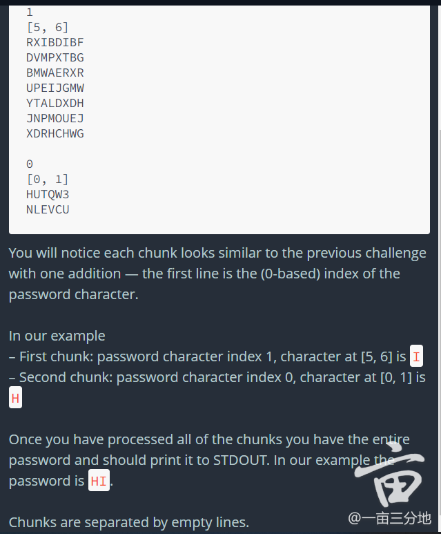
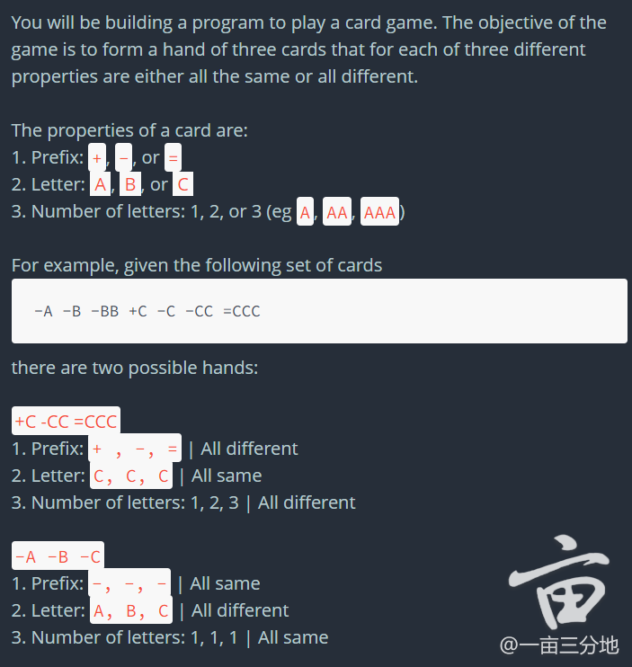

电面就是亘古不变的那道题，前面的面经都是那道。

疫情下的虚拟演出：

1. BQ/Bar Raiser: 45 分钟，随便问了问 BQ 常见题，之前的 projects，什么原因想跳槽
2. System: Payment service for shopper. 楼主花了好久的时间才意识到 customer 和 shopper 不是一个概念，估计会挂在这一轮。。。
   Problem

At Instacart, we have customers that place orders on our website, and we hire personal shoppers whose job it is to go to grocery stores to fulfill those orders.

We give credit cards to our shoppers so they can purchase groceries for orders we've assigned them. Our servers receive an HTTP request from our payment processor every time a shopper swipes the credit card that we give them. The payload looks like this:

{
    shopper_id:  123，
    amount: 300,
    merchant: {
        name: "Target",
        address: "123 Main St"
    }
}

When we receive the HTTP request, we have to synchronously respond within 1 second with a 200 OK to approve the transaction or 402 Payment Required to decline the transaction.

Say you are hired tomorrow, and you're leading the three person team in this room.  How would you suggest we build the application that processes these requests? Some areas we should be sure to cover are _physical infrastructure, data stores, data model, security, and performance considerations_.  For simplicity, we should start off with the assumption that 1 Shopper has just 1 Order at 1 merchant.

3. Coding：简单的 parse in 文件合成密码，最后问放在产品端怎么改进。

follow up 是 The chunks look the same as before, but now rather than a single password the input contains a series of passwords, one following the other. You will know one password has ended and the next begun when you see an index repeated. Read only enough of the stream to find the first password and print it out.

4. Coding：一道类似 3sum 的题。解法是先 counter，如果有个 values >= 3，找到了一个；不然对每个 cardi，cardj，去合成 target，看它在不在 set 里。

