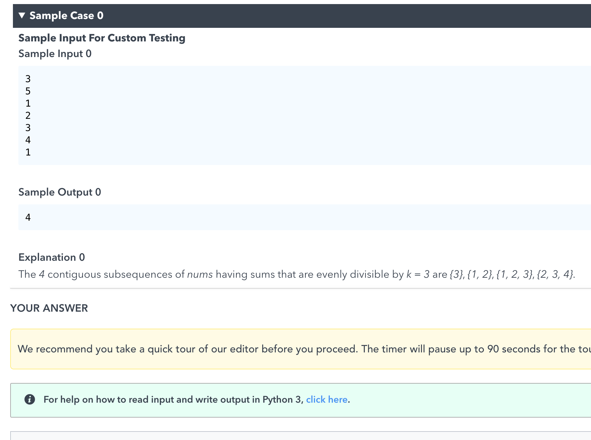

```java
class Solution {
    public int subarraysDivByK(int[] nums, int k) {
        HashMap<Integer, Integer> map = new HashMap<>();
        int sum = 0;
        int res = 0;
        map.put(0, 1);
        for (int num : nums) {
            sum = (sum + num % k + k) % k;
            if (!map.containsKey(sum)) {
                map.put(sum, 0);
            }
            res += map.get(sum);
            map.put(sum, map.get(sum) + 1);
        }

        return res;
    }
}
```
