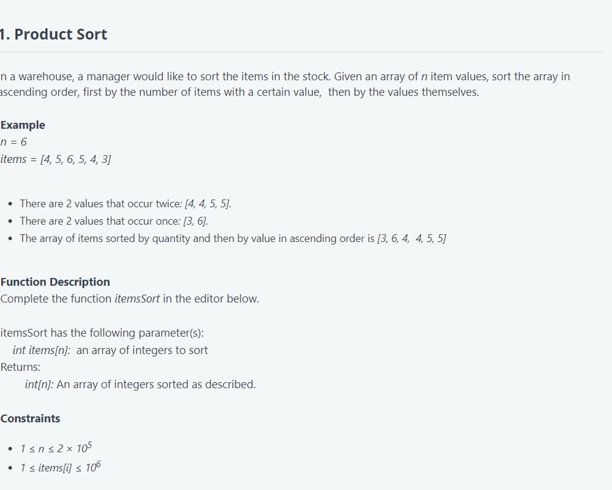
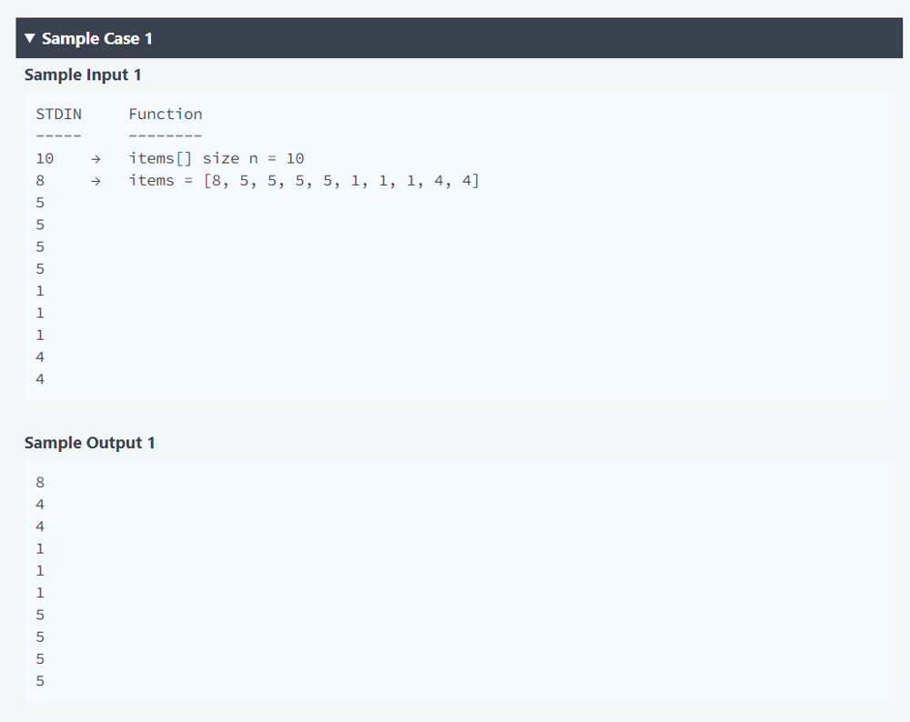

```python
def productSort(lst: list) -> list:
    if not lst:
        return lst
    count = Counter(lst)
    sorted_list = sorted(lst, key=lambda item: (count[item], item))
    return sorted_list
```
