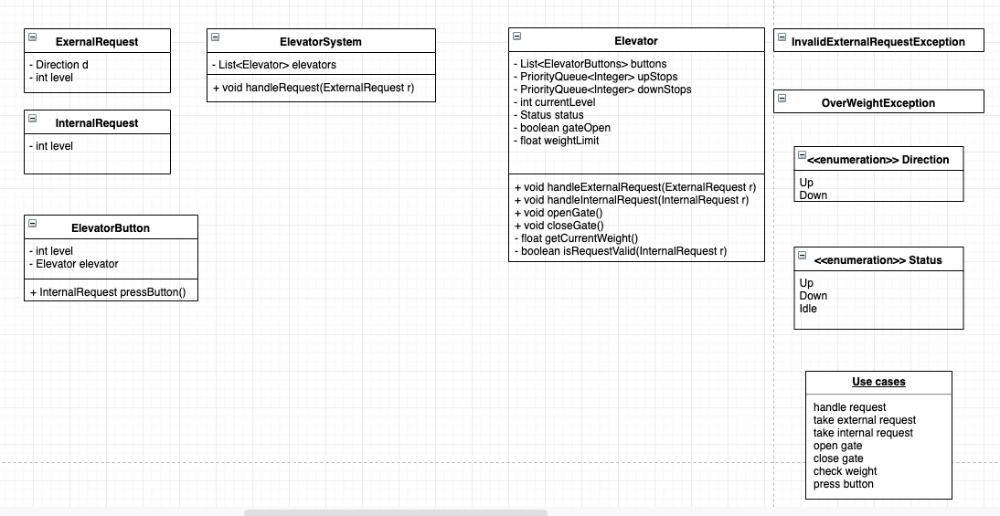

设计电梯系统

## 电梯系统， 不要写码，不要画图，说一下思路

---

### Clarify

- 去除题目中的歧义，确定答题范围
- 针对关键字提问，名词和功能 - what
- 功能是怎么样的 - how

- Is it for an elevator system?

### Core objects

- 确定所涉及的类
- 确定类之间的映射关系
- 为画类图打基础
- 第一个类大概率是题目本身，比如 ElevatorSystem
- 画出类名之后，考虑输入和输出
- 考虑函数的类型, public(+), private(-), protected(#)

### Cases

- 确定题目中需要的功能 functions
- 例如电梯, take external request, take internal request, open gate, close gate, check weight
- 每个 use case 对应一个函数

### Classes

- 画类图
- 添加类名和函数

### Correctness

- 最后检查一遍设计，确定满足功能

