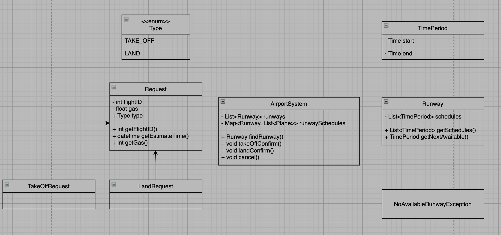

简历+ood，飞机塔台，白人妹子面的，没啥问题

设计飞机起降控制台

飞机起降时要如何与塔台沟通

Design 一個塔台跟飛機的交流 API
這部分不太像是考 System Design
是考你的思考過程
一開始面試官什麼都沒給
只問我你覺得這個 API 需要有什麼功能
我就說需要讓飛機知道他們可以用哪個跑道
面試官就從這個點繼續問
像是飛機需要給塔台什麼資訊 (ex: airplane Id, take off time)
原本以為他會不會是想問類似 job scheduler 或是 task queue
結果面試官一直說不用考慮那個
假裝你有一個很聰明的 Backend 可以處理這些
最後討論了起飛跟降落的差別
總之整個過程沒討論到什麼 technical 的問題
不確定是不是只有我這樣 (我的面試官是臨時更換的)



# Step 1 - Understand the problem and establish design scope

## Questions

- what is the most important features?
- what kinds of planes?
- plane size?
- gas?
- estimate land time/take off time
- land to other airport?
- big or small airport? QPS?
- weather?

given a flight -> return a runway

# Step 2 - Propose high-level design and get buy-in

## 2.1 Where to put the rate limiter?

## 2.2 Rate limiting algorithm

- high consistency
- cannot use cache in most cases

post /api/v1/land

```json
{
  "estimate_date_time": "2021-12-12 20:21",
  "gas": 100,
  "relocate": false,
  "size": "A5"
}
```

response

```json

```

# Step 3 - Design deep dive

# Step 4 - Wrap up
