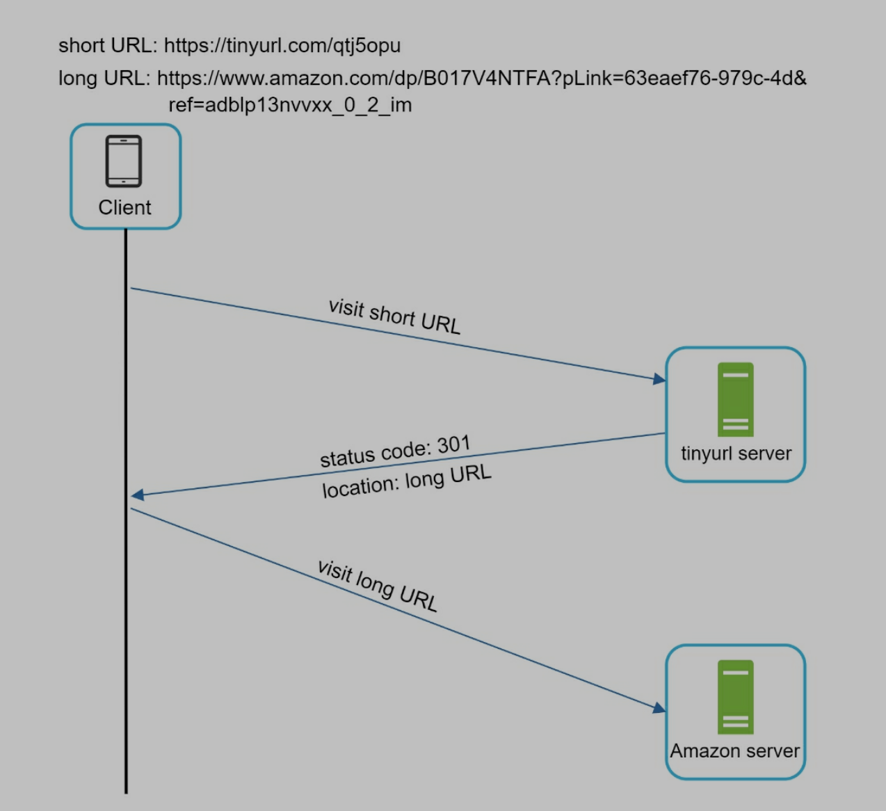
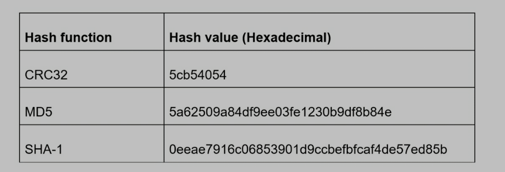
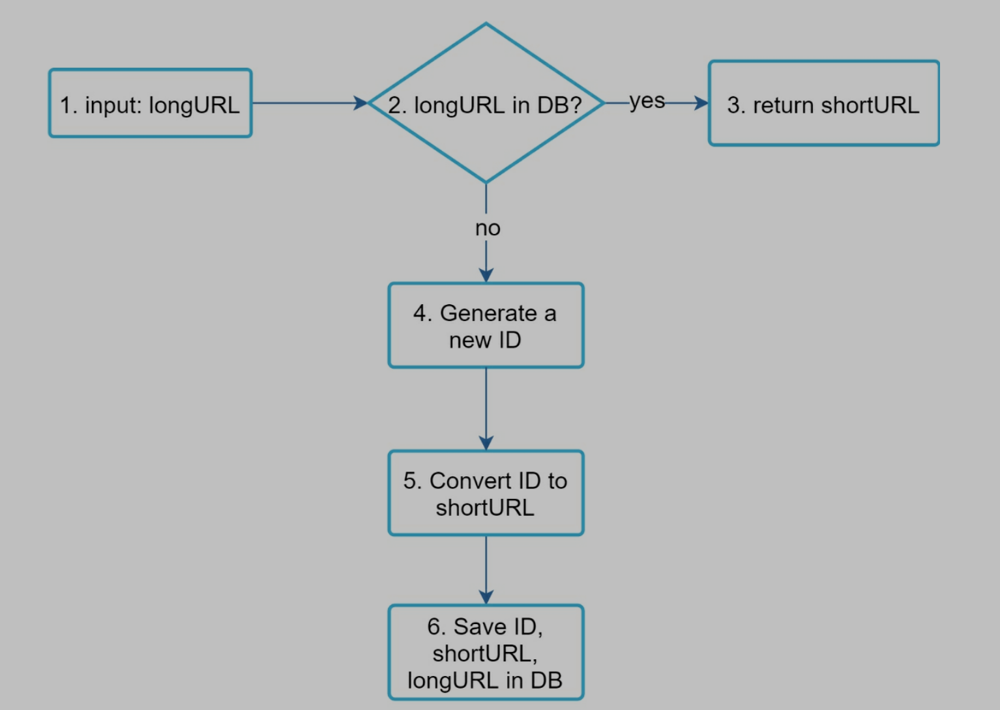
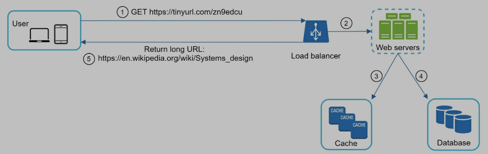

重点讨论 offline generating service

# Design a URL shortener

# Step 1: Understand the problem and establish design scope

## 1.1 Questions

- Candidate: Can you give an example of how a URL shortener work?
- Interviewer: Assume URL https://www.systeminterview.com/q=chatsystem&c=loggedin&v=v3&l=long is the original URL. Your service creates an alias with shorter length: https://tinyurl.com/y7keocwj. If you click the alias, it redirects you to the original URL.
- Candidate: What is the **traffic volume**?
- Interviewer: **100 million** URLs are generated per day.
- Candidate: How long is the shortened URL?
- Interviewer: As short as possible.
- Candidate: What characters are allowed in the shortened URL?
- Interviewer: Shortened URL can be a combination of numbers (0-9) and characters (a-z, A-Z).
- Candidate: Can shortened URLs be deleted or updated?
- Interviewer: For simplicity, let us assume shortened URLs cannot be deleted or updated.

## 1.2 Requirements

- URL shortening: given a long URL => return a much shorter URL
- URL redirecting: given a shorter URL => redirect to the original URL
- High **availability**, **scalability**, and **fault tolerance** considerations

## 1.3 Back of the envelope estimation

- Write operation: **100 million** URLs are generated per day.
- Write operation per second: 100 million / 24 /3600 = 1160
- Read operation: Assuming ratio of read operation to write operation is 10:1, read operation per second: 1160 \* 10 = 11,600
- Assuming the URL shortener service will run for **10 years**, this means we must support 100 million \* 365= 36.5 billion records.
- Assume average URL length is 100.
- Storage requirement over 10 years: 365 billion \* 100 bytes \* 10 years = 365 TB

# Step 2: Propose high-level design and get buy-in

## 2.1 API endpoints

- URL shortening
  - Create new short URL
  - POST api/v1/data/shorten
    - {longUrl: longUrlString}
    - return shortUrl
- URL redirecting
  - Redirect short URL to long URL
  - GET api/v1/shortUrl
  - Return longURL for HTTP redirection

## 2.2 URL redirecting

- Short URL response
- Server returns 301 and a long URL

- 301 redirect
  - Requested URL is permanently moved to long URL
  - Browser will cache response
  - Subsequent requests will be automatically redirected to long URL
  - Good for reducing server load
- 302 redirect
  - Requested URL is temporarily moved to long URL
  - Subsequent requests will be sent to short URL
  - Good for analytics

## 2.3 URL shortening

- Need a **hash function** to change long to short URL
- **Each long URL must be hashed to one hash value**
- **Each hash value can be mapped back to the long URL**

# Step 3: Design deep dive

## 3.1 Data model

> We can put data into hash table, but memory resources are expensive and limited. So we should put data into database.

## 3.2 Hash function

### 3.2.1 Hash value length

- Hash value includes [0-9, a-z, A-Z], 62 characters in total
- Find the min length n, 62 ^ n >= 365 billion (n = 7)

### 3.2.2 Hash + collision resolution

> Common hash functions

> How to get a hash value with length 7?

- Get first 7 characters in hash value
- When hash collision happens, recursively append a new predefined string to the long URL until no collision
- Cons
  - Query DB to check collision is expensive (we can use bloom filter to improve)

### 3.2.3 Base 62 conversion (62 characters)

- Generate unique ID (can be primary key in DB) for original URL, then use 62 characters to encode the URL
- Map: 0-0,..., 9-9, 10-a, 11-b, ..., 61-Z
- Example: 11157 = 2 x 62^2 + 55 x 62^1 + 59 x 62^0 = [2, 55, 59] -> [2, T, X]

### 3.2.4 Comparison

## 3.3 URL shortening deep dive

1. Long URL input
2. Check if long URL is in DB
3. If so, meaning it was converted to short URL before, fetch the short URL and return
4. if not, long URL is new. Unique ID generator creates a new unique ID (primary key)
5. Convert ID to short URL with base 62 conversion
6. Create a new DB row with ID, shortURL, longURL.

> Example

1. Input https://en.wikipedia.org/wiki/Systems_design
2. Unique ID generator: ID: 2009215674938
3. Convert ID to shortURL with base 62 conversion, 2009215674938 -> zn9edcu
4. Save ID, short URL, long URL to DB

> Refer to Chapter 7 learn how to generate unique ID in a distributed system

## 3.4 URL redirecting deep dive

- More read, we can save <shortURL, longURL> mapping into a cache
- Workflow
  - Input short URL in browser
  - Load balancer send request to server
  - If short URL in cache, return long URL
  - If short URL not in cache, get long URL from DB
  - If not in DB, it is an invalid URL
  - Long URL returns to client

# Step 4: wrap up

- Rate limiter: a security problem.
  - Malicious users send a large number of URL shortening requests.
  - Refer to chapter 4
- Web server scaling: web tier is stateless, so it is easy to add/remove web servers
- Database scaling: replication and sharding
- Analytics: add tools to check how many visits for URLs
- Availability, consistency, reliability: refer to chapter 1
